# 📌 LivinParis - Problème Scientifique & Informatique

# Structuration de la solution

Avant toute chose, et afin de suivre le fil des explications ci-dessous, voici le lien de notre repository Github : **LivinParis-Mathieu-Antonin** ainsi que le lien `.git` du repository lui-même : **LivinParis-Mathieu-Antonin-Git**.

Cela étant dit, voici les différentes étapes de notre solution, et pourquoi il y a plein de projets visibles à l’intérieur :

## 📁 Projets

### Pour le rendu 1, les projets concernés sont les suivants :

- **ClassLibraryRendu1** – pour stocker toutes nos classes
- **TestUnitairesRendu1** – pour les tests unitaires
- **WinFormsRendu1** – pour faire tourner tout notre rendu en Windows Forms.

### Pour le rendu 2, les projets concernés sont les suivants :

- **ClassLibraryRendu2** – comme son nom l’indique, nous sert uniquement à stocker toutes nos classes. Nous aurions pu les stocker toutes dans un dossier `Models` au sein du projet **LivinParisWebApp** mais la structure est très convenable et aérée.
- **TestUnitairesRendu1** – est un projet de tests unitaires afin de tester justement les classes de la librairie, au même endroit que le rendu 1. Il contient tout un tas de tests écrits pendant le développement pour s’aider ou bien après si besoin de tester d’autres subtilités des fonctions pour couvrir la majorité des cas de casse.
- **LivinParisWebApp** – est le cœur de notre solution. C’est lui qui va, étant de type **Razor Page**, nous permettre de générer 100% de notre solution en interface graphique et de faire le lien entre le frontend et le backend.  
  En effet, la partie frontend est codée en **HTML**, **CSS**, **Javascript** dans des fichiers d’extension `.cshtml` et le backend est évidemment codé en **C#** dans des classes directement reliées au frontend, d’extension `.cshtml.cs`.

### Pour le rendu 3

Nous envisageons la même structure que le rendu 2, mis à part le fait que la librairie de classe se nomme **ClassLibrary** et que le projet de tests unitaires sera nommé **TestsUnitaires**. C’est simplement afin d’avoir un rendu final sans numéro.

---

## ⚙️ Prérequis avant lancement (certainement incomplet)

1. Avoir la version **9.0 du SDK .NET** : [Lien de téléchargement](https://dotnet.microsoft.com/fr-fr/download/dotnet/9.0)
2. Très important, installez les outils de développement Web en suivant les étapes suivantes :
   a. Cliquez une fois sur le bouton Windows et cherchez **Visual Studio Installer**  
   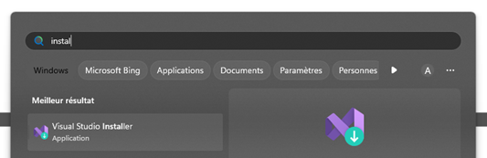

   b. Lancez ce logiciel, puis cliquez sur **Modifier** 
   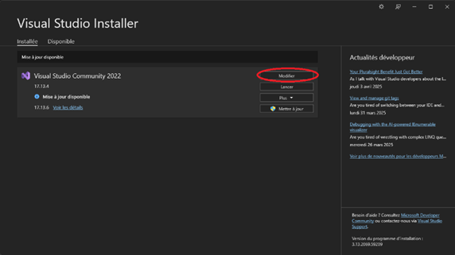 

   c. Cochez la case **Développement web et ASP.NET** 
   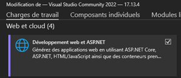 

   d. Puis sur la droite cochez les mêmes cases que ci-dessous  
   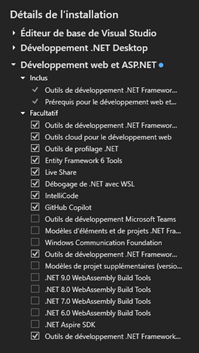

   e. Enfin, cliquez sur **Modifier** et l’installation se lancera
   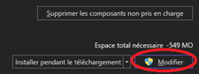

3. Installez tous les packages **NuGet** nécessaires au lancement du projet :
   a. Rendez-vous dans **Outils** puis dans **Gérer les packages**  
   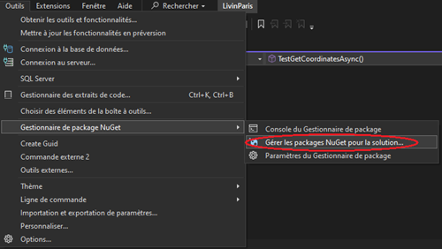

   b. Veuillez installer les packages suivants (le 2e s’installant avec le 3e)
   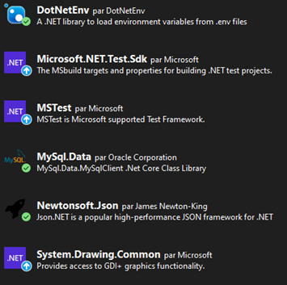

4. Au niveau des références du build, tout devrait être bon directement sur Github, donc vous ne devriez pas rencontrer de problème vis-à-vis de ça sur la version finale, c’est-à-dire au lancement du projet **LivinParisWebApp**.
5. Veillez à bien avoir un fichier `.env` au même niveau que le fichier `.exe` du projet **LivinParisWebApp**.  
   L’arborescence doit être la suivante :  
   `/LivinParisWebApp/bin/Debug/net9.0/.env`
6. Vérifiez bien le placement du fichier `stations.mtx` dans le dossier `/LivinParisWebApp/wwwroot/data/`.

---

## 🚀 Lancement

- Afin de lancer le bon projet (**LivinParisWebApp**), veillez à bien sélectionner le bon projet de démarrage.
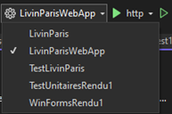

- Une fois ceci fait, vous pouvez lancer le projet avec le bouton **▶️** juste sur la droite.
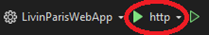

---

## 🔐 Panel Administrateur

Pour vous rendre sur cette page bien cachée pour des raisons évidentes, veuillez suivre la démarche suivante :

1. À l’arrivée sur le site, vous arrivez sur la page **Login**.
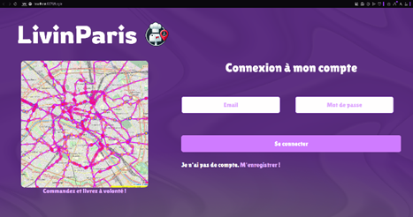
2. Une fois ici, modifiez l’URL `/Login` par `/AdminConfig` comme ceci :
   
   `/Login` → `/AdminConfig`
   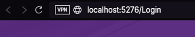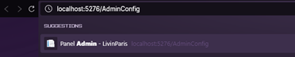

3. Cliquez sur la touche **Entrer** et vous serez alors redirigé sur la page **Admin**, avec toutes les stats et actions possibles en tant qu’administrateur de l’application (non terminée).
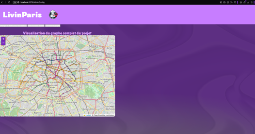

---

## 👥 Auteurs
👨‍💻 **[Mathieu]** - [Github](https://github.com/Thieuthieu77)

👩‍💻 **[Antonin]** - [Github](https://github.com/Blatahead)

---
